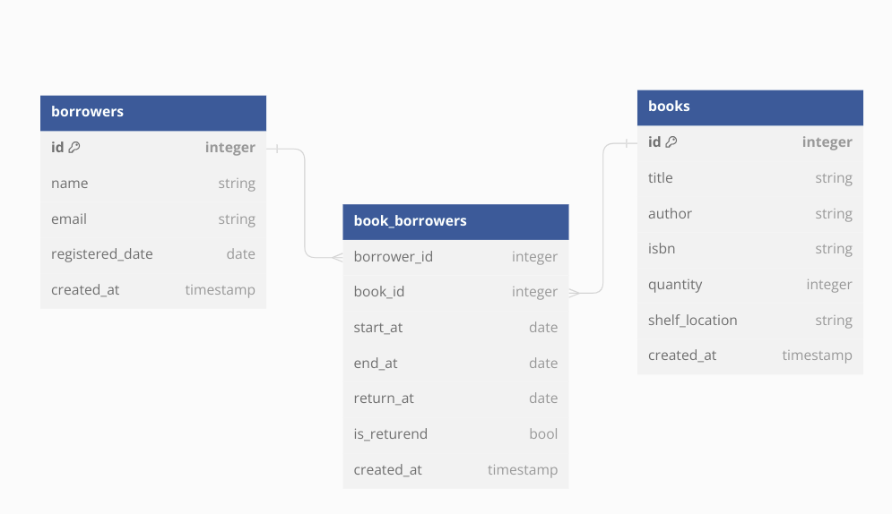

# Library API
Library API for **_Bosta_** Backend Engineer Assesment made with Nodejs,Postgres

## Running The API 

You must have docker and docker-compose installed.

```bash
docker-compose up
```
## Database Diagram


## API Documentation

### Requests
Books endpoints
```http
GET    /api/books
GET    /api/books/:id
GET    /api/books/search:query
POST   /api/books
PUT    /api/books/:id
DELETE /api/books/:id
```

Borrowers endpoints
```http
GET    /api/borrowers
GET    /api/borrowers/:id
POST   /api/borrowers
PUT    /api/borrowers/:id
DELETE /api/borrowers/:id
```

Borrowing Process endpointes

```http
GET    /api/borrowers/:borrower_id/books
POST   /api/borrowers/:borrower_id/checkout/:book_id
POST   /api/borrowers/:borrower_id/return/:book_id
```

System Reports
```http
GET  /api/books/overdue
```

### Responses

The structure of response 
```javascript
{
    "type": "success",
    "message": "message",
    "data": {
    }
}
```
In case of error
```http
{
    "type": "error",
    "message": "borrower is not defined",
    "error": {}
}
```

### Example
Example of search endpoint
```http
GET    /api/books/search/Ami
```
Example response
```javascript
{
    {
    "type": "success",
    "message": "you have 1 search results",
    "data": {
        "result": [
            {
                "id": 5,
                "title": "Math",
                "author": "Amin",
                "isbn": "1054",
                "quantity": 1,
                "shelf_location": "B2",
                "createdAt": "2023-09-27T03:11:48.802Z",
                "updatedAt": "2023-09-27T03:11:48.802Z"
            }
        ]
    }
}
}
```
